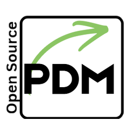
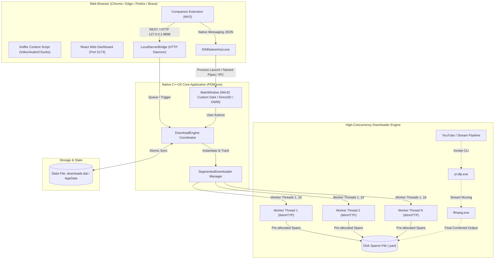
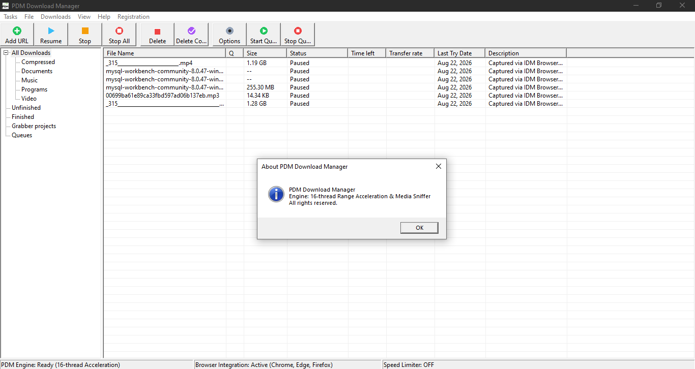

<div align="center">
  
  <h1>PDM</h1>
  <p><strong>Next-Gen High-Performance C++20 Multithreaded Download Accelerator & Media Sniffer</strong></p>

  [](https://en.cppreference.com/w/cpp/20)
  [](https://microsoft.com/windows)
  [](https://react.dev/)
  []()
  [](LICENSE)
</div>

---

## Table of Contents

- [System Architecture](#system-architecture)
  - [High-Level Architecture Diagram](#high-level-architecture-diagram)
  - [Core Components Breakdown](#core-components-breakdown)
- [Download Engine & Acceleration Algorithms](#download-engine--acceleration-algorithms)
  - [Dynamic Segment Slicing & Multi-Threading](#dynamic-segment-slicing--multi-threading)
  - [Segment Stealing & Dynamic Rebalancing](#segment-stealing--dynamic-rebalancing)
  - [Chunk Assembly & Zero-Corruption Merging](#chunk-assembly--zero-corruption-merging)
  - [Direct I/O Buffering & Memory Management](#direct-io-buffering--memory-management)
- [Edge Cases & Fault Tolerance](#edge-cases--fault-tolerance)
  - [Byte-Range Header Quirks & Server Caveats](#byte-range-header-quirks--server-caveats)
  - [Dynamic & Session-Expiring URLs](#dynamic--session-expiring-urls)
  - [Disk Space Pre-Allocation & Low-Disk Protection](#disk-space-pre-allocation--low-disk-protection)
  - [Stall Detection & Auto-Reconnection](#stall-detection--auto-reconnection)
  - [Path Sanitization & UTF-8 / UTF-16 Conversion](#path-sanitization--utf-8--utf-16-conversion)
  - [Graceful Shutdown & State Persistence](#graceful-shutdown--state-persistence)
- [Media Sniffing & Stream Pipeline](#media-sniffing--stream-pipeline)
  - [Browser Companion Extension (Manifest V3)](#browser-companion-extension-manifest-v3)
  - [Native Messaging Protocol & Local HTTP Bridge](#native-messaging-protocol--local-http-bridge)
  - [Stream Extraction, yt-dlp & FFmpeg Muxing](#stream-extraction-yt-dlp--ffmpeg-muxing)
- [UI & UX Design Systems](#ui--ux-design-systems)
  - [Native Win32 Dark Mode Desktop UI](#native-win32-dark-mode-desktop-ui)
  - [Live Chunk Visualizer](#live-chunk-visualizer)
  - [Interactive React + Vite Dashboard](#interactive-react--vite-dashboard)
- [Project Directory Structure](#project-directory-structure)
- [Build & Installation Guide](#build--installation-guide)
  - [Prerequisites](#prerequisites)
  - [Building Native Windows Binary (C++20)](#building-native-windows-binary-c20)
  - [Setting Up Browser Extension & Native Host](#setting-up-browser-extension--native-host)
  - [Running the React Web Interface](#running-the-react-web-interface)
- [Configuration & Settings](#configuration--settings)
- [Contributing & License](#contributing--license)

---

## System Architecture

The project employs a dual-tier hybrid architecture: a low-overhead, native high-performance C++20 desktop engine and an optional React web UI, coordinated through browser extensions and native IPC.

### High-Level Architecture Diagram



### Core Components Breakdown

1. **Native C++ Engine (`PDM.exe`)**:
   - Built on standard Win32, C++20, and `WinHTTP` APIs.
   - Zero bulky framework overhead (no Electron, no Qt runtimes).
   - Manages multithreaded chunk downloads, byte-level file serialization, real-time speed smoothing, queuing, and download persistence.

2. **Native Messaging Host (`IDMNativeHost.exe`)**:
   - Acts as a mediator between Chromium/Firefox browsers and the core engine via standard stdin/stdout byte-length-prefixed JSON messaging.
   - Automatically intercepts downloads or media clicks and triggers the native GUI dialogs with complete cookie/referrer headers.

3. **Local HTTP Server Bridge (`LocalServerBridge.hpp`)**:
   - Lightweight, embedded HTTP socket listener running on `127.0.0.1:9898`.
   - Allows both the browser extension and web interfaces to query download telemetry, add tasks, pause, or resume items seamlessly.

4. **Web UI Dashboard (`src/`)**:
   - Modern React 19 + Vite dashboard featuring a dark glassmorphic design, responsive layouts, active stream monitoring, and local storage state sync.

---

## Download Engine & Acceleration Algorithms

### Dynamic Segment Slicing & Multi-Threading

When a new URL is registered, the engine initiates a probing handshake:
1. **Capability Probe**: Sends a `HEAD` or ranged `GET` (Bytes 0-0) request to verify:
   - Status code `206 Partial Content` (confirms byte-range support).
   - `Content-Length` header for total payload size.
   - `Accept-Ranges: bytes` verification.
2. **Segment Distribution**:
   - If range requests are supported, the engine splits the file into $N$ equal chunks (configurable from 1 up to 16 concurrent connections).
   - Given a file size $S$ and connections $N$, chunk $k$ bounds are defined as:
     $$\text{Start}_k = k \cdot \left\lfloor\frac{S}{N}\right\rfloor, \quad \text{End}_k = \begin{cases} (k+1) \cdot \left\lfloor\frac{S}{N}\right\rfloor - 1 & \text{if } k < N-1 \\ S - 1 & \text{if } k = N-1 \end{cases}$$
3. **Fallback Single Stream**:
   - If the server answers with `200 OK` (ignoring the Range request) or does not provide `Content-Length`, the engine safely falls back to a single streaming thread, capturing data until EOF without corrupting chunk boundaries.

### Segment Stealing & Dynamic Rebalancing

To avoid the **"Long-Tail Problem"** (where one slow connection holds up the entire download completion while other threads sit idle):
- When faster threads finish their allocated byte range, the engine detects active remaining chunks that have significant un-downloaded byte margins.
- The longest remaining chunk is split in half dynamically: the original thread continues downloading the first half, while the newly freed idle worker is assigned the second half with a new Range header.

### Chunk Assembly & Zero-Corruption Merging

The engine supports two primary file writing modes:
- **Direct Multi-Offset Sparse Writing (Direct Mode)**:
  - The destination target file is pre-allocated on disk to its final size.
  - Each thread opens its own `HANDLE` via `CreateFileW` with `FILE_SHARE_READ | FILE_SHARE_WRITE`.
  - Threads write directly to their specified byte offsets (`SetFilePointerEx`), eliminating an expensive end-of-download re-copy/assembly phase.
- **Segment-Part File Merge (Fallback Mode)**:
  - If direct random-access writing is not suitable, individual `.part[k]` files are stored and sequentially merged using high-speed 4MB block transfers directly into the final filename.

### Direct I/O Buffering & Memory Management

- **64-Byte Cache-Line Aligned Telemetry**: The shared live telemetry structure (`LiveStreamSlot`) is aligned with `alignas(64)` to prevent CPU cache-line bouncing (false sharing) across high-frequency worker threads.
- **Configurable Ring Buffers**: Uses 64KB–256KB WinHTTP chunk buffers, minimizing system call transitions and yielding maximum network saturation without bloating RAM consumption.
- **Dynamic Speed Limiter**: Implemented via a leaky-bucket token timing loop. If the user configures a download ceiling (e.g., 2048 KB/s), worker threads pause for microsecond intervals between packet bursts to respect bandwidth constraints smoothly.

---

## Edge Cases & Fault Tolerance

Industrial download managers must survive unpredictable real-world internet and file-system failures. Here is how PDM handles edge cases:

| Scenario | Challenge | Architectural Resolution |
| :--- | :--- | :--- |
| **Server Discards Byte-Range** | Server responds with `200 OK` instead of `206 Partial Content`. | Detects non-206 status immediately; aborts parallel chunk creation, switches to single-thread sequential streaming, and saves the file linearly. |
| **Unknown File Size (`Content-Length` Missing)** | Chunk splitting cannot mathematically calculate partition spans. | Treats stream as infinite chunk, piping chunks directly into disk until connection termination; progress displays indeterminate state. |
| **Dynamic / Short-Lived CDNs** | Cloudflare / Akamai tokens expire mid-download during a pause. | Stores session cookies, original referrer, user agent, and redirects. Features a "Refresh Download Address" workflow to swap URLs while keeping partially fetched bytes. |
| **Insufficient Disk Space** | Download fails halfway through, wasting gigabytes of traffic. | Checks target volume free space via `GetDiskFreeSpaceExW` **before** download starts. Aborts with an informative error if space is insufficient. |
| **Network Hiccups & Thread Stalls** | A TCP connection hangs indefinitely without closing the socket. | Per-socket `WINHTTP_OPTION_RECEIVE_TIMEOUT` and heartbeat polling (`lastPacketTime`). Any thread stalled for $> 15$ seconds automatically reconnects with an updated range offset. |
| **Filename Collisions & Invalid Characters** | Illegal characters (`/ \ : * ? " < > \|`) in `Content-Disposition`. | Automatically sanitizes file paths using Win32 naming rules, strips control codes, and appends `(1)`, `(2)` increment tags if collisions exist. |
| **Abrupt Power Loss / System Crash** | Corrupted progress logs or truncated files. | Progress states and chunk index boundaries are flushed to disk periodically using transactional temp files (`.dat.tmp` $\to$ `.dat` atomic replacement). |

---

## Media Sniffing & Stream Pipeline

PDM features an integrated media interceptor capable of extracting and downloading streaming media from modern web platforms.

### Browser Companion Extension (Manifest V3)

- **Deep Network Interception**: Uses `chrome.webRequest` and `chrome.declarativeNetRequest` to inspect network streams for video/audio payloads (`.mp4`, `.m3u8`, `.mpd`, `.webm`, `.ts`, `.flv`).
- **DOM Sniffing Script**: Injected into web pages to detect HTML5 `<video>`, `<audio>`, and Blob URLs that are loaded dynamically by streaming players.
- **Smart Quality Picker**: Displays an overlay download bar directly on video platforms, letting users select desired resolutions (4K, 1080p, 720p, 60fps) or audio-only formats.

### Native Messaging Protocol & Local HTTP Bridge

Interactions between the browser and desktop app happen via two redundant channels:
1. **Chrome Native Messaging**:
   - `IDMNativeHost.exe` listens to `stdin` using 32-bit unsigned little-endian length prefixes followed by UTF-8 JSON payloads:
     ```json
     {
       "action": "download",
       "url": "https://example.com/video.mp4",
       "filename": "video.mp4",
       "cookies": "SESSION=xyz...",
       "referer": "https://example.com/",
       "userAgent": "Mozilla/5.0..."
     }
     ```
2. **Localhost REST API**:
   - The desktop client hosts `http://127.0.0.1:9898/` to accept direct API calls:
     - `POST /add-download`: Schedule or immediately start a download.
     - `GET /stats`: Retrieve live aggregate speed, queue count, and chunk statuses.

### Stream Extraction, yt-dlp & FFmpeg Muxing

For complex platforms with separated adaptive video and audio streams (such as YouTube DASH or TikTok):
1. **Metadata & Format Probing**: Invokes `yt-dlp` in JSON mode (`--dump-json`) to retrieve all available video and audio streams, bitrates, and file formats.
2. **Concurrent Stream Download**: The engine concurrently downloads the high-res video stream and the audio stream.
3. **Lossless Multiplexing (Muxing)**:
   - Calls the embedded `ffmpeg.exe` with fast copy flags:
     ```bash
     ffmpeg -i input_video.mp4 -i input_audio.m4a -c:v copy -c:a aac -map 0:v:0 -map 1:a:0 -shortest output.mp4
     ```
   - Automatically cleans up intermediate stream pieces once muxing completes.

---

## UI & UX Design Systems

### Native Win32 Dark Mode Desktop UI

The native desktop interface is engineered in pure C++20 with custom Win32 message handling, delivering snappy 60fps responsiveness with zero memory overhead:
- **Windows 11 Mica & DWM Dark Frame**: Full integration with `DwmSetWindowAttribute`, supporting system-wide dark titlebars, custom window borders, and high-DPI scaling.
- **Custom-Drawn Controls**: Owner-drawn list views, gradient progress bars, and custom styled toolbars powered by GDI+ and Direct2D.
- **Instant Response**: Under 15MB base RAM usage even with multiple active connections.

<div align="center">
  
  <p><em>Native Win32 Desktop Interface — Download Queue with Real-Time Telemetry & Progress</em></p>
</div>

### Live Chunk Visualizer

The **Chunk Visualizer** provides a real-time graphic representation of how files are fetched across all threads:
- **Connection Segments**: Color-coded segments representing connection statuses:
  - Receiving: Active inbound payload.
  - Connecting / Stalled: Establishing socket handshake or waiting on packets.
  - Writing to Disk: Buffering payload to disk file.
  - Completed: Downloaded and verified.
- **Interactive Metrics**: Shows latency in milliseconds, per-connection transfer rate, and current read/write offsets.

<div align="center">
  
  <p><em>Real-Time Multi-Segment Buffer Visualizer & Connection Telemetry Matrix</em></p>
</div>

### Interactive React + Vite Dashboard

For remote control or modern browser-based management, a companion React 19 dashboard is included:
- **Modern Glassmorphic Visuals**: Translucent glass panels, subtle border glows, vibrant neon accents, and smooth transitions.
- **Live Filtering**: Instant filtering by categories (*All, Compressing, Video, Music, Programs, Documents*).
- **Floating Sniffer Studio**: Live feed showing URLs and streams detected across browser tabs.

<div align="center">
  
  <p><em>Web Companion Dashboard — Glassmorphic Theme with Floating Media Sniffer Studio</em></p>
</div>

---

## Project Directory Structure

```plaintext
PDM/
├── cpp/                                # Core Native C++ Engine
│   ├── CMakeLists.txt                  # CMake build configuration (C++20)
│   ├── build.bat                       # Automated MSVC / CMake compile script
│   ├── resource.rc                     # Windows icons, manifests & version resources
│   ├── include/                        # Header files
│   │   ├── DownloadEngine.hpp          # Download coordinator & queue manager
│   │   ├── SegmentedDownloader.hpp     # Multi-connection worker & chunk rebalancer
│   │   ├── Models.hpp                  # Thread-safe structs (LiveStreamSlot, DownloadItem)
│   │   ├── LocalServerBridge.hpp       # Embedded HTTP server for IPC (Port 9898)
│   │   ├── Win32Dark.hpp               # Windows Dark Mode & DWM theming
│   │   ├── IconFactory.hpp             # High-DPI icon rasterizer & category icons
│   │   ├── PersistenceManager.hpp      # Atomic state serialization to disk
│   │   └── ...                         # Dialog headers (AddUrl, Properties, Options, etc.)
│   └── src/                            # Implementation files
│       ├── MainWindow.cpp              # Primary Win32 GUI window & message loop
│       ├── DownloadEngine.cpp          # Engine logic, process execution & disk workers
│       ├── IDMNativeHost.cpp           # Native messaging host executable for browsers
│       └── ...                         # Win32 dialog implementations
├── src/                                # React 19 + Vite Web Application
│   ├── components/                     # UI Components (Sidebar, Toolbar, Modals, Visualizer)
│   ├── extension/                      # Browser Companion Extension (MV3)
│   │   ├── manifest.json               # Chrome/Edge Manifest V3 definition
│   │   ├── native-host-manifest.json   # Native Messaging registry schema
│   │   ├── background.js               # Extension background service worker
│   │   ├── content.js                  # Stream & media link sniffer
│   │   └── popup/                      # Extension quick-action popup
│   ├── services/                       # LocalStorage & web download simulation services
│   ├── App.jsx                         # Main React application entry
│   └── index.css                       # Modern CSS design tokens & animations
├── tools/                              # External CLI dependencies (yt-dlp, ffmpeg)
├── package.json                        # Node.js dependencies & scripts
├── vite.config.js                      # Vite bundler configuration
└── install_extension_host.bat          # Registry installation script for Native Host
```

---

## Build & Installation Guide

### Prerequisites

- **Operating System**: Windows 10 (1809+) or Windows 11 (64-bit recommended).
- **C++ Compiler**: Visual Studio 2022 (MSVC v143) with C++20 support or Clang-CL.
- **CMake**: Version 3.20 or newer.
- **Node.js**: Version 18.0 or newer (for the React web dashboard).
- **Optional CLI Tools**: Place `yt-dlp.exe` and `ffmpeg.exe` in the `tools/` folder or ensure they are present in your system `PATH` for video extraction.

### Building Native Windows Binary (C++20)

1. Open **x64 Native Tools Command Prompt for VS 2022**.
2. Navigate to the project root:
   ```cmd
   cd "D:\Download Manager AB"
   ```
3. Run the automated build script:
   ```cmd
   call cpp\build.bat
   ```
   Or build via CMake directly:
   ```cmd
   cmake -B cpp/build -S cpp -DCMAKE_BUILD_TYPE=Release
   cmake --build cpp/build --config Release
   ```
4. The output binaries will be created in `cpp/build/Release/`:
   - `PDM.exe` (Main Desktop App)
   - `IDMNativeHost.exe` (Browser Native Host)

### Setting Up Browser Extension & Native Host

1. **Register the Native Host**:
   Run the included batch script as Administrator to register the native messaging host in your Windows Registry:
   ```cmd
   install_extension_host.bat
   ```
2. **Load Extension in Chromium (Chrome, Edge, Brave)**:
   - Navigate to `chrome://extensions/` or `edge://extensions/`.
   - Enable **Developer mode** (toggle in upper right corner).
   - Click **Load unpacked** and select the folder:
     `d:\Download Manager AB\src\extension`
3. Verify that the extension badge turns active when browsing streaming sites.

### Running the React Web Interface

If you wish to run the React web frontend alongside or in standalone mode:

```bash
# 1. Install dependencies
npm install

# 2. Run Vite local dev server
npm run dev
```

Open `http://localhost:5173` in your browser.

---

## Configuration & Settings

PDM provides fine-grained control over network operations through its Options dialog:

- **Connection Limits**:
  - `Default Connections per File`: 1 to 16 streams (default: 8).
  - `Global Maximum Active Downloads`: 1 to 10 concurrent files.
- **Bandwidth Management**:
  - `Speed Limiter`: Toggleable global download ceiling configured in KB/s.
- **Download Automation**:
  - `Auto-Categorization`: Automatically sorts files into `Music`, `Video`, `Programs`, `Documents`, and `Compressed` folders based on file extensions.
  - `Clipboard Monitoring`: Automatically detects URLs copied to the Windows Clipboard and presents the quick-download prompt.
  - `Temporary Segment Directory`: Custom drive location for temporary `.part` buffers (recommended on fast NVMe SSDs).

---

## Contributing & License

Contributions, bug reports, and pull requests are welcome!

1. Fork the Project.
2. Create your Feature Branch (`git checkout -b feature/AmazingFeature`).
3. Commit your Changes (`git commit -m 'Add some AmazingFeature'`).
4. Push to the Branch (`git push origin feature/AmazingFeature`).
5. Open a Pull Request.

Distributed under the **MIT License**. See `LICENSE` for more information.
